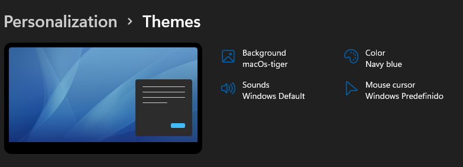

<h1 align="center"> 🎨 Themes for Windows 11 😄</h1>

    

 <a href="#status">Status</a> • 
 <a href="#objective">Objective</a> •
 <a href="#installation">Installation</a> • 
 <a href="#technology">Technology</a> • 
 <a href="#author">Author</a> • 
 <a href="#licence">License</a>

<h2 align="center" id=status> 
	⌛ Concluded ⌛
</h2>

<h2 id=objective>📜 About</h2>
The aim of the project is to share the themes I use on Windows 11. 
The Purple theme was made to be more generic. I love that.

Included themes:

- Flamingo Theme
- Gnome Theme
- MacTiger
- Purple Theme

<h2 id=installation>✔️ Installation</h2>

1. Clone the repo.
2. Go to the "themes" folder
3. Double click on the desired theme

Note: Tested on Windows 11

<h2 id=technology>🧰 Technology</h2>

The following tools were used in the construction of the project:

- IDE: <a href="https://code.visualstudio.com/download">Visual Studio Code</a>
- Image manipulator: <a href="https://www.gimp.org/downloads/">Gimp</a>

<h2 id=author>😎 Author</h2>

Developed by <a href="https://www.linkedin.com/in/danhpaiva/" target="_blank">Daniel Paiva</a>

<h2 id=licence>🆓 Licence</h2>
<a href="https://github.com/danhpaiva/windows11-themes/blob/main/LICENSE" target="_blank">MIT</a>
